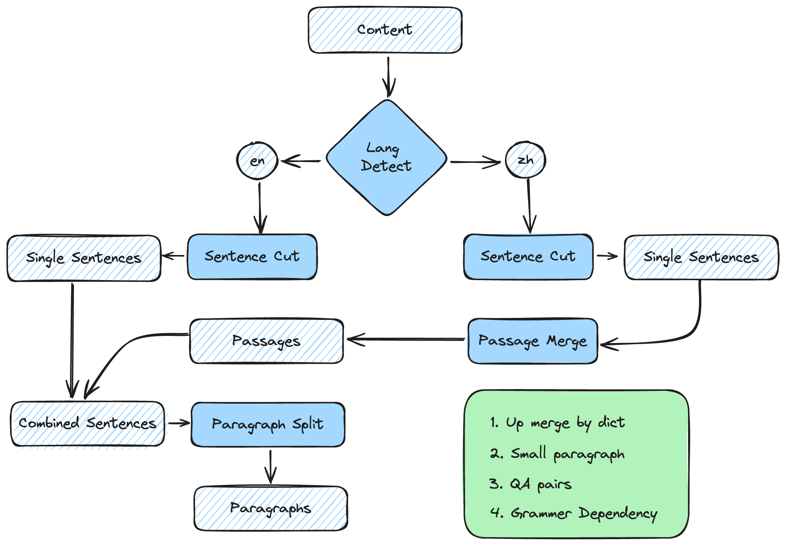

# Semantic Paragraph Splitter

<div align="center">
  <a href="https://github.com/Jeru2023/">
    
  </a>
</div>

## Embedding Cut
## LLM Cut
Put your gemini api key in config/config.ini
Make sure your proxy route in Japan or US, keep "Enhanced Mode" on.

调用方法:

```python
from llm_cutter import LLMCutter
  
content = "some text"
llm_cutter = LLMCutter()
result = llm_cutter.cut_paragraph(content)
```

输出:

<code>
{
    {
        "paragraph": "本周国内碳酸锂产量较假期有所增加，锂盐厂家陆续开工，治炼厂库存略有累积。多数检修的锂盐厂将于元宵节前后复工，但大部分停产的外购锂矿的中小型锂盐企业表示将根据市场行情择机恢复生产，初步预计2月碳酸锂产量将环比下滑23%至3.2万吨附近。中长期维度看，今明两年是上游锂矿和盐湖放量的大年，碳酸锂供应过剩的压力较大。消息面上，20日晚上市场有关于江西碳酸锂环保停产的传闻传出，后传闻的内容多数被证伪，但锂盐企业表示近期有相关环保回头看活动。周五上午，澳洲锂生产商ArcadiumLithium在财报中显示，因受成本压力影响，Mt Catt1in矿山在2024年的锂辉石精矿产量预期将从2023年的20.5万吨下降至13万吨（减产约9500吨LCE）。",
        "tags": ["碳酸锂产量", "锂盐厂", "锂矿", "环保", "锂辉石精矿"]
    },
    {
        "paragraph": "本周需求端有小幅改善。正极等下游企业已经逐渐采购现货补充原料，但对当前价位的接受度不高。供需双方仍处于博弈中，需求主导价格走势。中游锂电逐渐进入排产旺李，但鉴于电池厂的高库存及订单前置，节后实际补库需求的强度仍需观察。终端市场方面，受节前促销活动刺激购车需求提前释放，春节期间消费者需求不振，且经销商库存仍需消耗，2月国内新能源汽车产销或将继续环比下滑。电动车价格战仍在持续，行业内卷加剧，对应车企降本压力较大。",
        "tags": ["需求端", "下游企业", "锂电", "新能源汽车", "电动车"]
    },
    {
        "paragraph": "本周国内锂精矿价格小幅下跌，锂盐生产企业对于原料的补库意愿不强，多持观望情绪。进口方面，由于锂盐厂持续的长单提货、非洲锂矿集中到港的影响，预计2月锂矿到港量仍处相对高位。",
        "tags": ["锂精矿", "锂盐", "进口", "非洲锂矿"]
    },
    {
        "paragraph": "本周受消息面影响，碳酸锂期货的价格震荡反弹。深层次原因是，经过前期的持续下跌后，市场对做空的因素已经演绎得比较充分。而随着需求旺季的到来，下游有一定的补库预期，叠加供应端出现的扰动，碳酸锂期货的价格短期可能仍有一定的上行动能。操作上，短期多空资金博弈加剧，消息面扰动较多，建议投资者暂时观望为主。",
        "tags": ["碳酸锂期货", "需求旺季", "供应端", "消息面"]
    },
    {
        "paragraph": "2023年12月中国锂矿石进口数量为42.30万吨，环比增加14.07%，同比增加32.65%。其中从澳大利亚进口28.80万吨，环比增加36.4%，同比增加11.2%。自巴西进口1.09万吨，环比减少70.6%，同比减少4.6%。）由于锂盐厂持续的长单提货、非洲锂矿集中到港的影响，预计2月的到港量仍处相对高位，矿端供应偏宽松。雅化集团在津巴布韦自有矿山Kamativi首批5000吨锂精矿将陆续运达国内。目前项目一期采选生产规模年处理矿石量30万吨。二期采选生产规模年处理矿石量200万吨已同步启动建设，预计将于今年6月建成。一二期投产达标后项目年产锂精矿将达35万吨。",
        "tags": ["锂矿石进口", "澳大利亚", "巴西", "非洲锂矿", "雅化集团", "津巴布韦"]
    },
    {
        "paragraph": "本周锂精矿（6%）CIF中间价坏比下滑2.13%，锂云母（2-2.5%）精矿的价格环比持平。近期，锂矿跌势明显放缓。矿山出于自身现金流、股价因素考虑，即使有一定成本倒挂影响，短期内的产量预计依旧较为稳定。港口矿库存仍在累积，近期部分企业争取到M+2的定价模式。",
        "tags": ["锂精矿", "锂云母", "港口矿库存", "M+2定价模式"]
    },
    {
        "paragraph": "本周电池级碳酸锂现货价格96000元/吨，较上周小幅下降0.5%。长协结清和套保机会使贸易商和锂盐生产商的出货压力有所下降，挺价意愿较强。下游厂家观望情绪较浓，对高价格的接受度不高。一本周工业级碳酸锂价格88500元/吨，较上周持平。",
        "tags": ["电池级碳酸锂", "工业级碳酸锂", "长协结清", "套保"]
    },
    {
        "paragraph": "今年1月新能源汽车产销分别完成78.7万辆和72.9万辆，环比分别下降32.9%和38.8%，同比分别增长85.3%和78.8%，市场占有率达到29.9%，销售情况不及市场预期。受节前促销活动刺激购车需求提前释放，春节期间消费者需求不振，且经销商库存仍需消耗，2月国内新能源汽车产销或将继续环比下滑。电动车价格战仍在持续，2月19日比亚迪发文秦PLUS、驱逐舰05荣耀版上市，7.98万元起售。行业内卷加剧，对应车企降本压力较大。",
        "tags": ["新能源汽车", "产销", "比亚迪", "电动车价格战"]
    }
}
{
    {
        "paragraph": "本周国内碳酸锂产量较假期有所增加，锂盐厂家陆续开工，治炼厂库存略有累积。多数检修的锂盐厂将于元宵节前后复工，但大部分停产的外购锂矿的中小型锂盐企业表示将根据市场行情择机恢复生产，初步预计2月碳酸锂产量将环比下滑23%至3.2万吨附近。中长期维度看，今明两年是上游锂矿和盐湖放量的大年，碳酸锂供应过剩的压力较大。消息面上，20日晚上市场有关于江西碳酸锂环保停产的传闻传出，后传闻的内容多数被证伪，但锂盐企业表示近期有相关环保回头看活动。周五上午，澳洲锂生产商ArcadiumLithium在财报中显示，因受成本压力影响，Mt Catt1in矿山在2024年的锂辉石精矿产量预期将从2023年的20.5万吨下降至13万吨（减产约9500吨LCE）。",
        "tags": ["碳酸锂产量", "锂盐厂", "锂矿", "环保", "锂辉石精矿"]
    },
    {
        "paragraph": "本周需求端有小幅改善。正极等下游企业已经逐渐采购现货补充原料，但对当前价位的接受度不高。供需双方仍处于博弈中，需求主导价格走势。中游锂电逐渐进入排产旺李，但鉴于电池厂的高库存及订单前置，节后实际补库需求的强度仍需观察。终端市场方面，受节前促销活动刺激购车需求提前释放，春节期间消费者需求不振，且经销商库存仍需消耗，2月国内新能源汽车产销或将继续环比下滑。电动车价格战仍在持续，行业内卷加剧，对应车企降本压力较大。",
        "tags": ["需求端", "下游企业", "锂电", "新能源汽车", "电动车"]
    },
    {
        "paragraph": "本周国内锂精矿价格小幅下跌，锂盐生产企业对于原料的补库意愿不强，多持观望情绪。进口方面，由于锂盐厂持续的长单提货、非洲锂矿集中到港的影响，预计2月锂矿到港量仍处相对高位。",
        "tags": ["锂精矿", "锂盐", "进口", "非洲锂矿"]
    },
    {
        "paragraph": "本周受消息面影响，碳酸锂期货的价格震荡反弹。深层次原因是，经过前期的持续下跌后，市场对做空的因素已经演绎得比较充分。而随着需求旺季的到来，下游有一定的补库预期，叠加供应端出现的扰动，碳酸锂期货的价格短期可能仍有一定的上行动能。操作上，短期多空资金博弈加剧，消息面扰动较多，建议投资者暂时观望为主。",
        "tags": ["碳酸锂期货", "需求旺季", "供应端", "消息面"]
    },
    {
        "paragraph": "2023年12月中国锂矿石进口数量为42.30万吨，环比增加14.07%，同比增加32.65%。其中从澳大利亚进口28.80万吨，环比增加36.4%，同比增加11.2%。自巴西进口1.09万吨，环比减少70.6%，同比减少4.6%。）由于锂盐厂持续的长单提货、非洲锂矿集中到港的影响，预计2月的到港量仍处相对高位，矿端供应偏宽松。雅化集团在津巴布韦自有矿山Kamativi首批5000吨锂精矿将陆续运达国内。目前项目一期采选生产规模年处理矿石量30万吨。二期采选生产规模年处理矿石量200万吨已同步启动建设，预计将于今年6月建成。一二期投产达标后项目年产锂精矿将达35万吨。",
        "tags": ["锂矿石进口", "澳大利亚", "巴西", "非洲锂矿", "雅化集团", "津巴布韦"]
    },
    {
        "paragraph": "本周锂精矿（6%）CIF中间价坏比下滑2.13%，锂云母（2-2.5%）精矿的价格环比持平。近期，锂矿跌势明显放缓。矿山出于自身现金流、股价因素考虑，即使有一定成本倒挂影响，短期内的产量预计依旧较为稳定。港口矿库存仍在累积，近期部分企业争取到M+2的定价模式。",
        "tags": ["锂精矿", "锂云母", "港口矿库存", "M+2定价模式"]
    },
    {
        "paragraph": "本周电池级碳酸锂现货价格96000元/吨，较上周小幅下降0.5%。长协结清和套保机会使贸易商和锂盐生产商的出货压力有所下降，挺价意愿较强。下游厂家观望情绪较浓，对高价格的接受度不高。一本周工业级碳酸锂价格88500元/吨，较上周持平。",
        "tags": ["电池级碳酸锂", "工业级碳酸锂", "长协结清", "套保"]
    },
    {
        "paragraph": "今年1月新能源汽车产销分别完成78.7万辆和72.9万辆，环比分别下降32.9%和38.8%，同比分别增长85.3%和78.8%，市场占有率达到29.9%，销售情况不及市场预期。受节前促销活动刺激购车需求提前释放，春节期间消费者需求不振，且经销商库存仍需消耗，2月国内新能源汽车产销或将继续环比下滑。电动车价格战仍在持续，2月19日比亚迪发文秦PLUS、驱逐舰05荣耀版上市，7.98万元起售。行业内卷加剧，对应车企降本压力较大。",
        "tags": ["新能源汽车", "产销", "比亚迪", "电动车价格战"]
    }
}
<code>
